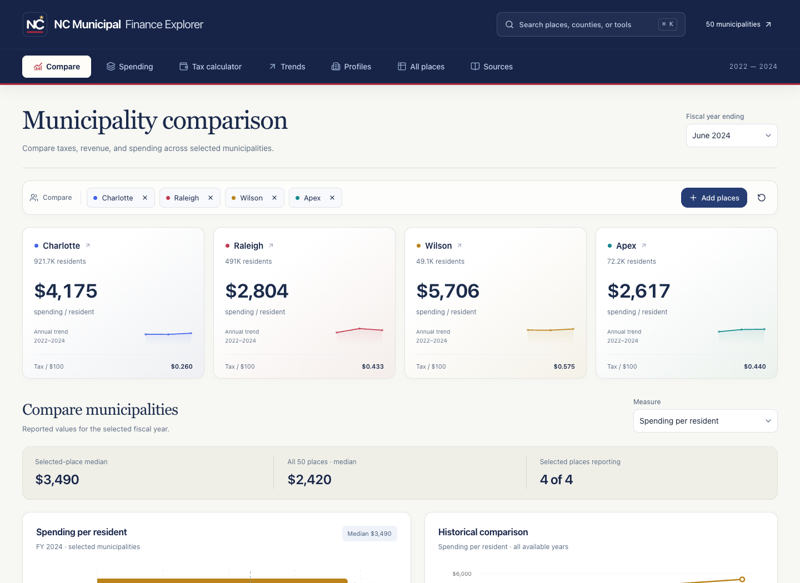
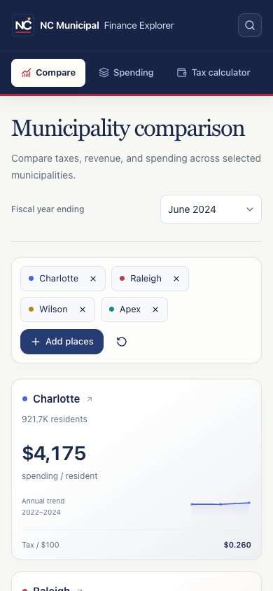

# NC Municipal Finance Explorer

Compare taxes, spending, debt, and financial trends across 50 North Carolina municipalities. Built with **Next.js, shadcn/ui, Recharts, and Supabase**.

**[Open the app](https://nc-municipal-finance-explorer.vercel.app/)**

## Screenshots



<details><summary>Mobile layout</summary>



</details>

## Features

- **Compare:** city cards, ranking charts, medians, and sortable tables.
- **Spending:** revenue/expenditures, spending per resident, and service categories.
- **Tax calculator:** municipal-only, county-only, or combined estimates.
- **Trends:** historical comparisons across available fiscal years.
- **Profiles:** individual finances and peer comparisons.
- **All places:** browse the full municipal dataset.
- **Sources:** methodology and accounting limitations.

Charlotte, Raleigh, Wilson, and Apex are selected initially. **Cmd/Ctrl+K** searches municipalities, counties, and analysis views. Filters stay above the charts.

## Data and methodology

The app reads the existing Supabase `municipal_finance` table, not a bundled CSV. The prepared dataset contains **150 rows, 50 municipalities, and fiscal years ending June 2022–2024**.

Official agencies: [NC Department of Revenue](https://www.ncdor.gov/) (property taxes), [NC Department of State Treasurer / Local Government Commission](https://www.nctreasurer.com/) (financial reporting), and [NC Office of State Budget and Management](https://www.osbm.nc.gov/) (population). See the app’s Sources view and source metadata for dataset-specific references. The collection pipeline and original Streamlit app are maintained separately from this frontend repository.

- Missing values display as **Not reported**, never silently become zero.
- Estimated tax = assessed value × published rate ÷ 100; rates are dollars per $100 assessed value.
- Combined estimates require both rates. County rates refer to the dataset’s dominant county; check the actual property county for multi-county municipalities.
- Estimates exclude special districts, exemptions, fees, and other assessments. Assessed value may differ from market value.
- Per-resident metrics use the prepared dataset’s population and financial values.
- Composition charts require broad categories to reconcile within 2% of expenditures. Municipal classifications and services can differ.
- Similar-population peers use ±25%; peer medians exclude the focus municipality. There is no best/worst city score.
- Higher spending and lower taxes alone do not establish good or bad management.

## Run locally

Requires **Node.js 22+**.

```bash
npm ci
cp .env.example .env.local
```

Set these variables in the ignored `.env.local` file:

```dotenv
NEXT_PUBLIC_SUPABASE_URL=https://your-project-ref.supabase.co
NEXT_PUBLIC_SUPABASE_PUBLISHABLE_KEY=your-publishable-key
```

Use a **publishable** key, never a secret or service-role key. The table must allow the required public read access; public keys do not replace access policies.

```bash
npm run dev
```

Open [localhost:3000](http://localhost:3000).

## Validate

```bash
npm run lint
npm test
npm run build
```

Regression tests cover tax calculations, missing values, peers, composition, and historical gaps. Synthetic test fixtures are never used as app data. The production build uses webpack.

## GitHub → Vercel

Connect this repository to the existing **nc-municipal-finance-explorer** Vercel project, using **main** as the production branch and the repository root as the application root.

1. Open Vercel → Project → **Settings → Git** and connect the GitHub repository.
2. Keep the **Next.js** framework and `main` production branch.
3. Set the two Supabase variables in Vercel’s Production and Preview environment settings, not in GitHub files.
4. Push commits to `main` for production deployments. Pull requests receive preview deployments through Vercel’s Git integration.
5. Confirm the deployment’s source commit matches GitHub before releasing.

Native Git integration does not require a Vercel token in GitHub Actions. Environment values remain in Vercel.

## Structure

```text
src/app/                   Page, layout, and styles
src/components/dashboard/  Views and charts
src/components/ui/         shadcn/ui components
src/lib/                   Calculations and Supabase access
public/nc-mark.svg          Custom NC identity
tests/                     Calculation tests
docs/screenshots/          Real app screenshots
.env.example               Placeholders only
vercel.json                Hosting configuration
```

## Security

Environment files, `.vercel`, dependencies, build output, private keys, and logs are excluded from Git. Never commit database passwords, service-role keys, tokens, or screenshots showing credentials. Revoke accidentally committed secrets immediately; deleting a value from the latest file does not remove it from history.
